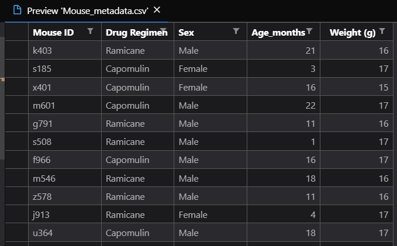
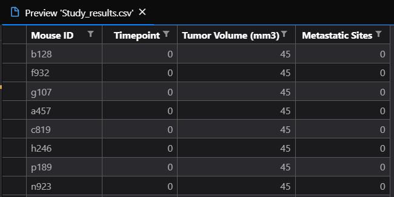

# Matplotlib Exercise

The objetive of this exercise is to work with `matplotlib.plot` to generate plots and to see the diference between it and `pandas.DataFrame.plot()`. For this I worked with some fake data about anti-cancer pharmaceuticals and their animal study.

## Data

The data contains two csv files, one with the mouse metadata and another with the study results.

* Mouse Metadata contains data from 250 mice identified with SCC tumor growth:

* Study Resutls contains the results of the tumor development that was observed and measured over the course of 45 days:

### Objective

The purpose of this study was to compare the performance of drug of interest, Capomulin, versus the other treatment regimens. For that I decided to generate:

* Summary statistics table consisting of the mean, median, variance, standard deviation, and SEM of the tumor volume for each drug regimen.
* Bar plot that shows the number of data points for each treatment regimen.
* Pie plot that shows the distribution of female or male mice in the study.
* Final tumor volume of each mouse across four of the most promising treatment regimens: Capomulin, Ramicane, Infubinol, and Ceftamin. Calculate the quartiles and IQR and quantitatively determine if there are any potential outliers across all four treatment regimens. Use a box and whisker plot of the final tumor volume for all four treatment regimens and highlight any potential outliers.
* Summary statistics table consisting of the mean, median, variance, standard deviation, and SEM of the tumor volume growth for each drug regimen.
* Line plot of time point versus tumor volume for all mouses treated of best performed Drug (Ramicane) and Capomulin.
* Calculate the correlation coefficient and linear regression model between mouse weight and average tumor volume for the Capomulin treatment. Plot the linear regression model on top of the previous scatter plot.

## Results

* Summary statistics table consisting of the mean, median, variance, standard deviation, and SEM of the tumor volume for each drug regimen.

  

* Bar plot that shows the number of data points for each treatment regimen.

  

* Pie plot that shows the distribution of female or male mice in the study.

  

* Final tumor volume of each mouse across four of the most promising treatment regimens: Capomulin, Ramicane, Infubinol, and Ceftamin. Calculate the quartiles and IQR and quantitatively determine if there are any potential outliers across all four treatment regimens. Use a box and whisker plot of the final tumor volume for all four treatment regimens and highlight any potential outliers.

  

* Summary statistics table consisting of the mean, median, variance, standard deviation, and SEM of the tumor volume growth for each drug regimen.

  

* Line plot of time point versus tumor volume for all mouses treated of best performed Drug (Ramicane) and Capomulin.
  * Capomulin

  

  * Ramicane

  

* Calculate the correlation coefficient and linear regression model between mouse weight and average tumor volume for the Capomulin treatment. Plot the linear regression model on top of the previous scatter plot.

  

### Some insights about the results

* The most promising treatment is Ramicane base on the lowest statistics values for the tumor volume.
* Base on the scatter plot, it could be assumed that the higher the weight, the higher tumor mass a mouse has.
* In Ramicane and Capomulin cases the drug seems to be reducing the volumen of the tumor in 96% of cases.

### Copyright

Trilogy Education Services © 2019. All Rights Reserved. Image retrive from Python for Undergraduate Engineers on 06/07/2020
